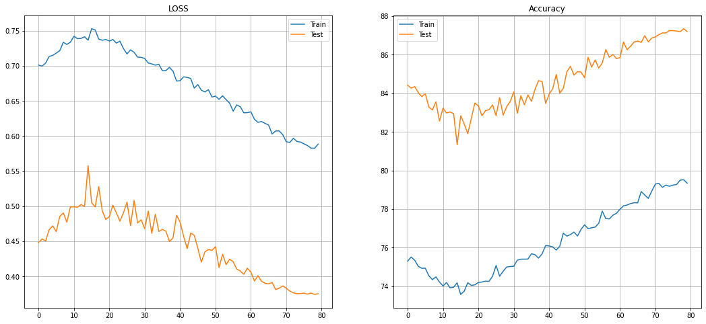

# Session 7 Assignment Advanced concepts

## Problem Statement
- Fix the network above:
  - change the code such that it uses GPU
  - change the architecture to C1C2C3C40 (No MaxPooling, but 3 3x3 layers with stride of 2 instead) (If you can figure out how to use Dilated kernels here instead of MP or strided convolution, then 200pts extra!)
  - total RF must be more than 52
  - two of the layers must use Depthwise Separable Convolution
  - one of the layers must use Dilated Convolution
  - use GAP (compulsory mapped to # of classes):- CANNOT add FC after GAP to target #of classes 
  - use albumentation library and apply:
      - horizontal flip
      - shiftScaleRotate 
      - coarseDropout (max_holes = 1, max_height=16px, max_width=1, min_holes = 1, min_height=16px, min_width=16px, fill_value=(mean of your dataset), mask_fill_value = None)
      - grayscale
  - achieve 87% accuracy, as many epochs as you want. Total Params to be less than 100k
  
## Problem Analysis

### Dataset used

- CIFAR-10 has 10 classes of 32,32 that are airplane, automobile, bird, cat, deer, dog, frog, horse, ship, truck

### Agumentation
- Agumentation is used to increase the dataset for training, if we have few images to train for a particular class
- We use albumentation library since its faster than Pillow library which pytorch uses generally
- Methods we used in Agumentation are

```
A.HorizontalFlip(),
A.ShiftScaleRotate(),
A.CoarseDropout(1, 16, 16, 1, 16, 16,fill_value=0.473363, mask_fill_value=None),
A.ToGray()
```

### Model used
  
 ```
  ----------------------------------------------------------------
        Layer (type)               Output Shape         Param #
================================================================
            Conv2d-1           [-1, 32, 32, 32]             864
       BatchNorm2d-2           [-1, 32, 32, 32]              64
              ReLU-3           [-1, 32, 32, 32]               0
           Dropout-4           [-1, 32, 32, 32]               0
            Conv2d-5           [-1, 32, 32, 32]           9,216
       BatchNorm2d-6           [-1, 32, 32, 32]              64
              ReLU-7           [-1, 32, 32, 32]               0
           Dropout-8           [-1, 32, 32, 32]               0
            Conv2d-9           [-1, 32, 16, 16]           9,216
      BatchNorm2d-10           [-1, 32, 16, 16]              64
             ReLU-11           [-1, 32, 16, 16]               0
          Dropout-12           [-1, 32, 16, 16]               0
           Conv2d-13           [-1, 64, 16, 16]          18,432
      BatchNorm2d-14           [-1, 64, 16, 16]             128
             ReLU-15           [-1, 64, 16, 16]               0
          Dropout-16           [-1, 64, 16, 16]               0
           Conv2d-17             [-1, 64, 8, 8]             576
           Conv2d-18             [-1, 64, 8, 8]           4,160
      BatchNorm2d-19             [-1, 64, 8, 8]             128
             ReLU-20             [-1, 64, 8, 8]               0
          Dropout-21             [-1, 64, 8, 8]               0
           Conv2d-22            [-1, 128, 8, 8]           1,152
           Conv2d-23            [-1, 128, 8, 8]          16,512
      BatchNorm2d-24            [-1, 128, 8, 8]             256
             ReLU-25            [-1, 128, 8, 8]               0
          Dropout-26            [-1, 128, 8, 8]               0
           Conv2d-27             [-1, 32, 8, 8]           4,096
      BatchNorm2d-28             [-1, 32, 8, 8]              64
             ReLU-29             [-1, 32, 8, 8]               0
          Dropout-30             [-1, 32, 8, 8]               0
           Conv2d-31             [-1, 32, 6, 6]           9,216
           Conv2d-32             [-1, 32, 4, 4]           9,216
      BatchNorm2d-33             [-1, 32, 4, 4]              64
             ReLU-34             [-1, 32, 4, 4]               0
          Dropout-35             [-1, 32, 4, 4]               0
           Conv2d-36             [-1, 32, 4, 4]           9,216
             ReLU-37             [-1, 32, 4, 4]               0
           Conv2d-38             [-1, 10, 4, 4]           2,880
        AvgPool2d-39             [-1, 10, 1, 1]               0
================================================================
Total params: 95,584
Trainable params: 95,584
Non-trainable params: 0
----------------------------------------------------------------
Input size (MB): 0.01
Forward/backward pass size (MB): 3.31
Params size (MB): 0.36
Estimated Total Size (MB): 3.69
----------------------------------------------------------------
```

The model we used had total 95,584 parameters, in which we used two depth-wise convolution layers and added a dilated layer in [transition_block-3](https://github.com/satyaNekkantiCompVison/ExtensiveVisionAI/blob/main/S7_AdvancedConcept/model/model.py#L74)
Above is model parameters in each layer and model has achieved and has following things
1. Less 100k parameters
2. Two Depth-wise convolutions
3. RF is greater than 52

### Training Log

```
epoch: 70
Batch_id=195 Loss=0.60209 Accuracy=78.94: 100%|████████████████████████████████████████████████| 196/196 [00:04<00:00, 43.44it/s]

Test set: Average loss: 0.3867, Accuracy: 8687/10000 (86.87%)

epoch: 71
Batch_id=195 Loss=0.59202 Accuracy=79.30: 100%|████████████████████████████████████████████████| 196/196 [00:04<00:00, 44.07it/s]

Test set: Average loss: 0.3832, Accuracy: 8692/10000 (86.92%)

epoch: 72
Batch_id=195 Loss=0.59100 Accuracy=79.33: 100%|████████████████████████████████████████████████| 196/196 [00:04<00:00, 43.25it/s]

Test set: Average loss: 0.3792, Accuracy: 8704/10000 (87.04%)

epoch: 73
Batch_id=195 Loss=0.59697 Accuracy=79.13: 100%|████████████████████████████████████████████████| 196/196 [00:04<00:00, 42.85it/s]

Test set: Average loss: 0.3768, Accuracy: 8713/10000 (87.13%)

epoch: 74
Batch_id=195 Loss=0.59244 Accuracy=79.24: 100%|████████████████████████████████████████████████| 196/196 [00:04<00:00, 43.11it/s]

Test set: Average loss: 0.3755, Accuracy: 8713/10000 (87.13%)

epoch: 75
Batch_id=195 Loss=0.59153 Accuracy=79.18: 100%|████████████████████████████████████████████████| 196/196 [00:04<00:00, 43.00it/s]

Test set: Average loss: 0.3758, Accuracy: 8725/10000 (87.25%)

epoch: 76
Batch_id=195 Loss=0.58909 Accuracy=79.24: 100%|████████████████████████████████████████████████| 196/196 [00:04<00:00, 43.24it/s]

Test set: Average loss: 0.3763, Accuracy: 8725/10000 (87.25%)

epoch: 77
Batch_id=195 Loss=0.58655 Accuracy=79.27: 100%|████████████████████████████████████████████████| 196/196 [00:04<00:00, 43.39it/s]

Test set: Average loss: 0.3749, Accuracy: 8723/10000 (87.23%)

epoch: 78
Batch_id=195 Loss=0.58294 Accuracy=79.50: 100%|████████████████████████████████████████████████| 196/196 [00:04<00:00, 43.96it/s]

Test set: Average loss: 0.3764, Accuracy: 8719/10000 (87.19%)

epoch: 79
Batch_id=195 Loss=0.58267 Accuracy=79.52: 100%|████████████████████████████████████████████████| 196/196 [00:04<00:00, 43.62it/s]

Test set: Average loss: 0.3744, Accuracy: 8735/10000 (87.35%)

epoch: 80
Batch_id=195 Loss=0.58862 Accuracy=79.34: 100%|████████████████████████████████████████████████| 196/196 [00:04<00:00, 43.74it/s]

Test set: Average loss: 0.3756, Accuracy: 8720/10000 (87.20%)
```
- The model has acheived 87% accuracy in 72 epoches and kept on increasing with increase of epoches

### Validation and Loss graphs

<p float="center">
  
</p>

### Model Learnings
- Replacing Max Pooling layer with a dilated kernel was a difficult task
- Sometimes over agumentation also kills the accuracy of the model
- We used implementation of Depthwise Convolution using https://github.com/seungjunlee96/Depthwise-Separable-Convolution_Pytorch


### References
1. https://github.com/fyu/dilation 
2. https://github.com/seungjunlee96/Depthwise-Separable-Convolution_Pytorch

### Team Members
1. Satya Nekkanti
2. Pranabesh Dash


